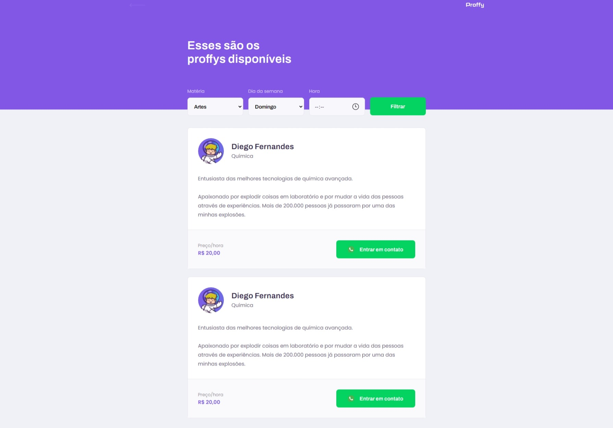
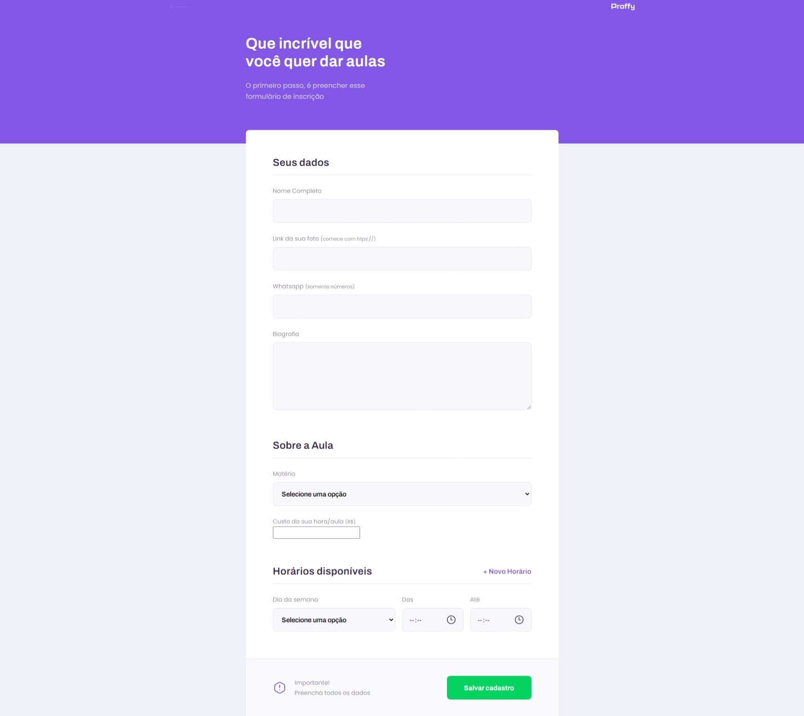

<h1 align="center">🏫Proffy</h1>

  <strong>Plataforma de estudos online, onde será possível conectar aluno-professor. Poderão ser agendados horários para estudos junto ao calendário disponibilizado pelo professor.</strong>

  

  

  

### Site 💻

- [Proffy](https://proffy-plataforma.netlify.app/)

## Linguagens: 🚀
- HTML
- CSS
- JavaScript
